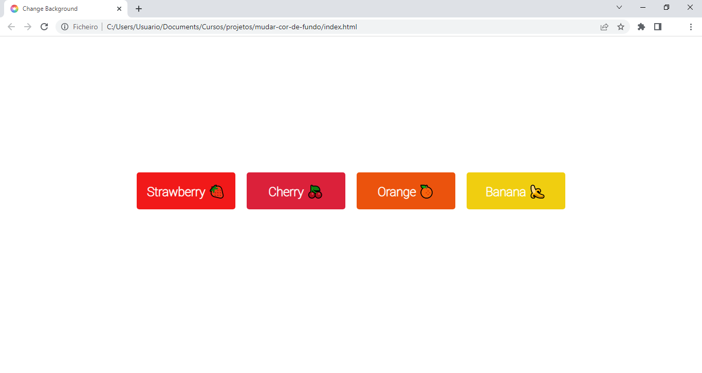

# Mudar a cor de fundo
Utilizando conceitos do DOM  (Document Object Model) desenvolvi um site que muda a cor de fundo quando o usuário clica em um dos botões. 

## Tecnologias usadas
- HTML5
- CSS3
- JavaScript

## Demonstração

<b>Demonstração em vídeo:</b> https://youtu.be/hdNasRXiGRA
